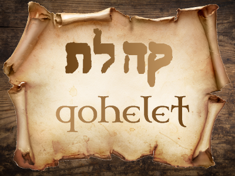

# Qohelet
Qohelet is a fully responsive theme for Wordpress. It has been built on the shoulders of giants, utilizing a number of other technologies, such as: 1. The Quark starter theme by Anthony Horton. 2. Quark is in turn built upon Underscores by Automattix. 3. Quark utilizes Normalize, Modernizr and Options Framework. 4. Many other smaller amounts of other technologies have been incorporated, so that I did not re-invent the wheel.

## Version 0.3
An earlier attempt to use the Redux Framework has proved too problematic for the moment, sso I have removed it and returned to the Options Framework. I still think the Redux Framework is a better one to use for this theme, but that will have to wait for a later version, as I would like to get this version out and ready.

A number of CSS changes have been made, in order to produce what, for me, is a more pleasing color scheme.

Quite a few changes were made to the blockquote CSS, and the Google fonts were substituted for ones that I prefer.

### Further Development
I like the way that the Simone theme keeps the main content in a central section, except for small screens, where the center section becomes 100% width. I would like to incorporate something similar. In addition, I would like the post meta data to be out at the left hand side, rather than as a header, as it is at the moment.

## Version 0.2
The Redux Framework has been added, and some adjustments made. However, the Options Framework has not yet been removed, as it is deeply embedded, and requires some special (of_get_option) functions to be removed or edited.

